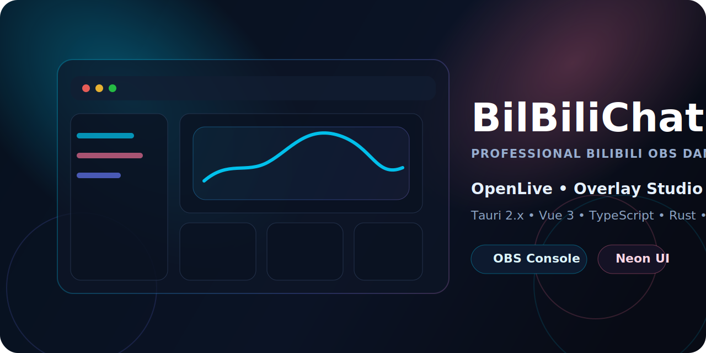
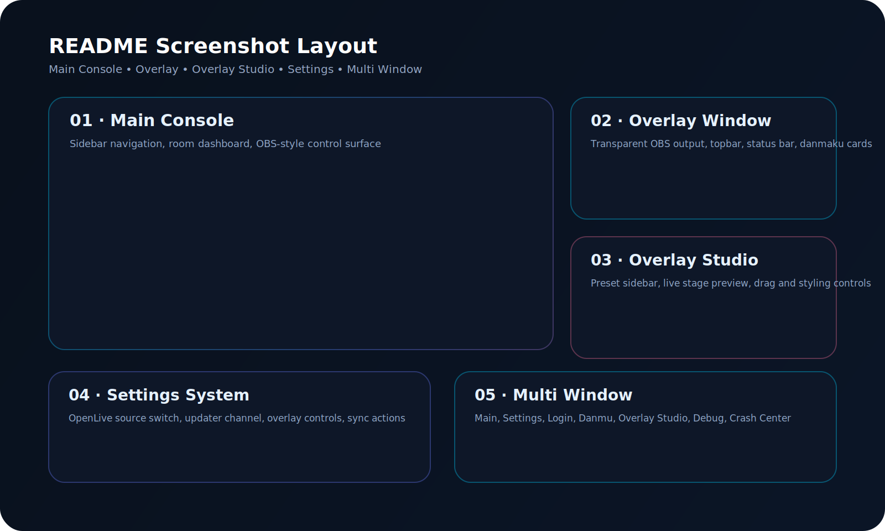
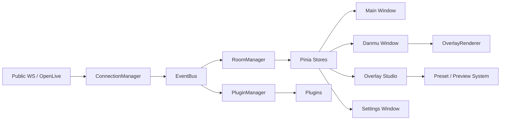

<div align="center">
  
  <h1>BilBiliChat</h1>
  <p><strong>Professional Bilibili OBS Danmaku Desktop Client</strong></p>
  <p>面向直播场景打造的专业级桌面弹幕控制台，结合 <code>OBS Overlay</code>、<code>OpenLive</code>、<code>Plugin System</code> 与多窗口工作流。</p>

  <p>
    <a href="https://github.com/JeffreyMing2004/BilBiliChat/actions/workflows/build.yml">
      
    </a>
    
    
    
    
    
    
  </p>
</div>



## 项目介绍
BilBiliChat 是一个面向 `Bilibili` 直播与 `OBS` 场景的专业级桌面客户端，目标不是简单显示弹幕，而是提供一套完整的直播工作台：

- 主控制台：房间管理、状态监控、登录、更新、插件、调试。
- OBS Overlay：透明输出、描边、阴影、礼物与 SC 高亮、点击穿透。
- Overlay Studio：可视化编辑 Overlay 布局与样式，并实时预览最终输出。
- OpenLive：官方身份码接入、会话生命周期、调试面板与 Overlay 增强。
- Plugin System：支持插件 API、Hook、动态加载与示例插件生态。

项目视觉方向结合了 `OBS Studio`、`Discord`、`Steam` 与 `Bilibili` 科技感，整体采用深色、Neon、桌面控制台式 UI。

## 截图区域
> 当前仓库已规划完整截图布局，建议在公开发布前将真实截图输出到 `docs/screenshots/` 并替换以下区域。



| 区域 | 建议文件名 | 展示内容 |
| --- | --- | --- |
| 主界面 | `docs/screenshots/main-console.png` | Sidebar、房间卡片、主播信息、状态面板 |
| Overlay | `docs/screenshots/overlay-window.png` | 透明弹幕输出、礼物样式、SC 高亮 |
| Overlay Studio | `docs/screenshots/overlay-studio.png` | 预设模板、样式滑杆、实时舞台 |
| 设置系统 | `docs/screenshots/settings-system.png` | OpenLive、更新渠道、同步导入导出 |
| 多窗口 | `docs/screenshots/multi-window.png` | Main / Danmu / Settings / Login / Studio 联动 |

截图布局详细说明见 [SCREENSHOT_LAYOUT.md](./docs/branding/SCREENSHOT_LAYOUT.md)。

## 功能特性
### 核心能力
- 多窗口桌面架构：`Main`、`Danmu`、`Settings`、`Login`、`Debug`、`Crash Center`、`Overlay Studio`。
- 多房间管理：连接、断开、重连、房间排序、激活房间切换。
- 直播消息处理：普通弹幕、礼物、SC、系统消息统一模型。
- 稳定性体系：`RecoveryManager`、`PerformanceMonitor`、`CrashReporter`。
- 更新体系：`Stable / Beta / Nightly` 渠道、后台下载、安装分离。

### Overlay 特性
- OBS 透明背景输出。
- 字体、粗细、描边、阴影、透明度、间距、方向、动画速度可调。
- 礼物样式与 SC 样式强化。
- 高 DPI、多显示器、多窗口场景兼容。
- 点击穿透与原生窗口模式切换。

### OpenLive 支持
- 官方身份码接入。
- `/v2/app/start`、`/heartbeat`、`/end` 生命周期链路。
- 官方长连接、心跳、错误处理、重连与房间状态管理。
- `PublicLiveProvider` 与 `OpenLiveProvider` 动态切换。
- 设置页状态面板、DebugWindow 协议日志与原始 JSON 观测。
- Overlay 显示用户等级、勋章、Guard、Like 与 SC 强化信息。

### Plugin System
- SDK 入口：`src/sdk/`。
- 插件目录：`plugins/`。
- Hook 范围：生命周期、消息、事件、Overlay 扩展。
- 动态加载与开发态热重载基础。
- 内置示例：`HelloPlugin`、`TTSPlugin`、`AutoReplyPlugin`。

## 技术栈
| 层级 | 技术 |
| --- | --- |
| Desktop Runtime | `Tauri 2.x` |
| Frontend | `Vue 3` + `TypeScript` + `Vite` |
| State Management | `Pinia` |
| Native Layer | `Rust` |
| UI | 自定义深色科技风 Design System + `Element Plus` |
| Overlay | `OBS Overlay`、透明窗口、样式引擎、渲染队列 |
| Live Provider | `Public WebSocket` + `OpenLive` |
| Extensibility | `PluginManager` + `Plugin SDK` |
| Delivery | `GitHub Actions` + `GitHub Releases` + `Tauri Updater` |

## 安装方法
### 方式一：下载 Release
1. 打开 [GitHub Releases](https://github.com/JeffreyMing2004/BilBiliChat/releases)。
2. 下载与你的平台匹配的安装包。
3. macOS 使用 `DMG`，Windows 使用 `NSIS / MSI`。

### 方式二：源码运行
```bash
npm install
npm run tauri dev
```

### 生产构建
```bash
npm run lint
npm run build
npm run tauri build
```

## 开发方法
### 环境要求
- Node.js `20+`
- Rust Stable
- Tauri CLI `2.x`
- macOS / Windows 开发环境

### 常用命令
```bash
# 安装依赖
npm install

# 前端开发
npm run dev

# 桌面开发
npm run tauri dev

# 类型检查 + 构建
npm run build

# 代码检查
npm run lint
```

### OpenLive 环境变量
在本地联调 OpenLive 前，请配置：

```bash
VITE_BILIBILI_OPENLIVE_APP_ID=
VITE_BILIBILI_OPENLIVE_ACCESS_KEY_ID=
VITE_BILIBILI_OPENLIVE_ACCESS_KEY_SECRET=
VITE_BILIBILI_OPENLIVE_API_BASE=
```

也可以直接复制仓库中的 `.env.example` 为 `.env` 后再填写真实配置。

OpenLive 详细文档见 [docs/openlive/README.md](./docs/openlive/README.md)。

## 项目结构
```text
BilBiliChat/
├─ .github/
│  ├─ workflows/
│  ├─ RELEASE_TEMPLATE.md
│  └─ release.yml
├─ docs/
│  └─ branding/
├─ plugins/
├─ public/
├─ src/
│  ├─ core/
│  ├─ modules/
│  ├─ providers/
│  ├─ sdk/
│  ├─ stores/
│  ├─ styles/
│  ├─ websocket/
│  ├─ window/
│  └─ windows/
├─ src-tauri/
│  ├─ capabilities/
│  ├─ icons/
│  └─ src/
├─ package.json
└─ README.md
```

## 架构设计
### 模块分层
- `src/core/`：连接、房间、事件、消息、渲染、恢复、崩溃、窗口桥接。
- `src/modules/`：设置、Overlay Studio、Updater、Sync、业务模块。
- `src/providers/`：OpenLive 等直播接入实现。
- `src/sdk/`：插件开发入口与加载器。
- `src/windows/`：多窗口视图层。
- `src-tauri/`：原生窗口、托盘、Updater、能力权限。

### 数据流


### 窗口与产品能力
- `MainWindow`：专业 OBS 控制台。
- `DanmuWindow`：正式 Overlay 输出窗口。
- `OverlayStudioWindow`：布局与样式编辑器。
- `SettingsWindow`：OpenLive、Updater、同步、Overlay 控制中心。
- `LoginWindow`：OAuth 授权与账号状态。

## Overlay Studio
- 内置预设模板与样式导入导出。
- 拖拽式舞台预览。
- 文字、透明度、阴影、描边、动画、礼物、SC 高亮一站式编辑。
- 面向 OBS 输出的视觉工作流，而不是简单参数面板。

## OpenLive 官方支持
- 已实现官方身份码接入、认证、长连接、心跳、重连、错误处理与 session 生命周期管理。
- 已实现 OpenLive 事件解析，并统一转换到 `MessageFactory` 标准消息模型。
- 已提供设置页状态面板、DebugWindow 原始事件查看与协议日志追踪。
- 已支持 `Public WS` 与 `OpenLive` 动态切换，并在失败时提供 fallback 路径。

## Plugin SDK
- 目标是构建 BilBiliChat 的插件生态基础层。
- 当前已支持基础注册、动态加载、启停与热重载基础。
- 后续将扩展 UI Hook、Overlay Hook、消息链路 Hook 与插件隔离能力。

## GitHub Actions
- 自动构建：Windows + macOS。
- 自动发布：GitHub Release。
- 自动生成更新工件：配合 `Tauri Updater`。

工作流见 [build.yml](./.github/workflows/build.yml)。

## Roadmap
详细路线见 [ROADMAP.md](./ROADMAP.md)。

### Phase 1 · Product Foundation
- [x] Tauri 2.x Desktop Runtime
- [x] Multi Window Architecture
- [x] OBS Overlay Rendering
- [x] GitHub Actions Build / Release
- [x] Design System and Theme Engine

### Phase 2 · Official Productization
- [x] Overlay Studio 基础版
- [x] OpenLive Provider 基础接入
- [x] Plugin SDK 基础能力
- [x] Crash Reporter / Crash Center
- [x] Updater 渠道化

### Phase 3 · Next Targets
- [ ] OpenLive 正式联调与生产验证
- [ ] Plugin SDK 完整生态 API
- [ ] AI Plugin 与自动化工作流
- [ ] Cloud Sync / WebDAV / GitHub Sync
- [ ] Linux / Windows / macOS 全平台体验统一

## Release 页面
- 自动发布建议使用本仓库提供的 [RELEASE_TEMPLATE.md](./.github/RELEASE_TEMPLATE.md)。
- 自动生成 Release Notes 分类可通过 [release.yml](./.github/release.yml) 管理。

## 品牌设计
- Banner 设计方案见 [BANNER_DESIGN.md](./docs/branding/BANNER_DESIGN.md)。
- Logo 设计方案见 [LOGO_DESIGN.md](./docs/branding/LOGO_DESIGN.md)。
- 截图布局规划见 [SCREENSHOT_LAYOUT.md](./docs/branding/SCREENSHOT_LAYOUT.md)。

## License
当前仓库尚未提交公开 `LICENSE` 文件。

如果 BilBiliChat 将以正式开源项目对外发布，推荐尽快补充明确许可证，以便插件生态、二次开发与分发边界保持清晰。

## Star History
> 预留：项目公开推广后建议启用 Star History 统计图。

[](https://www.star-history.com/#JeffreyMing2004/BilBiliChat&Date)
